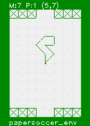

# papersoccer_env

This code is python code of Environment for Reinforcement Learning for game:  

**Paper Soccer**
https://en.wikipedia.org/wiki/Paper_soccer

  

## Dependencies
Image preview is implemented and it depends on:
- opencv
- numpy
(basic code only so any version shuld work fine)

## Notebook
For quick start you can check [this notebook](env.ipynb).
(some more dependencies here)